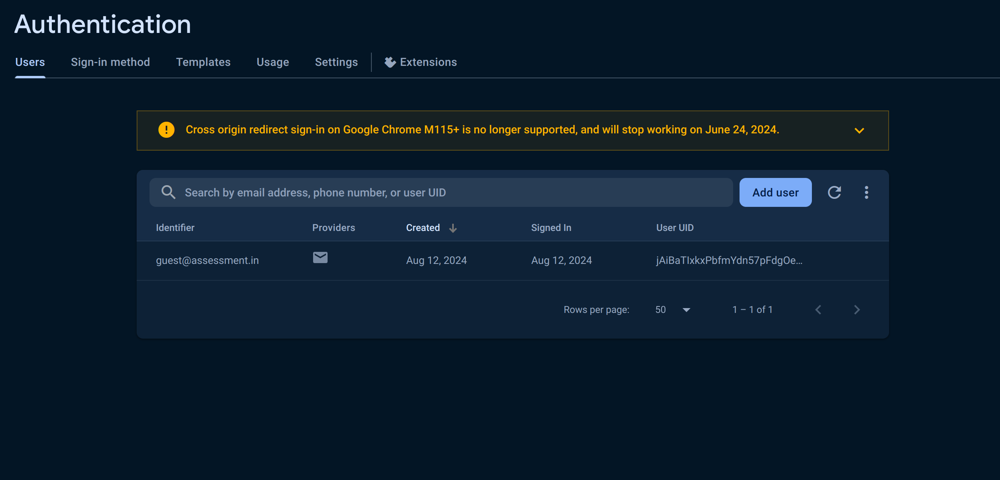
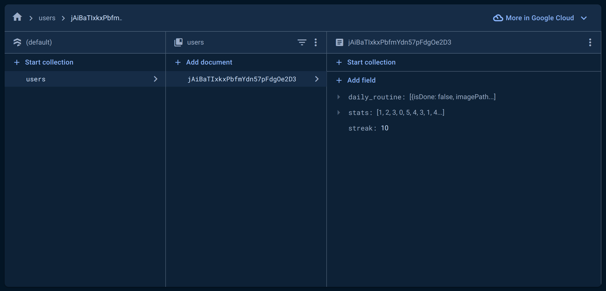

# Assessment App

This is an app to be submitted as a part of the Flutter Assessments for hiring process of [Urban Culture](https://www.urbanculture.me/).

## Getting started

1. Clone the repository
```
git clone https://github.com/aamit2267/urban-culture-assignment.git
```

2. Install dependencies
```
flutter pub get
```

3. Run the app
```
flutter run
```

## Firebase Setup
- Go to Firebase Console
- Create a new project
- Add your firebase configuration file (in lib folder, firebase_options.dart)
- Activate Authentication
- Select Email and Password
- Add your email and password and create a user
- Activate Firestore
- Make collection "users" -> add "<...your uid...>" and setup similar to given below
- Activate Storage


Note: 
- 'This app is for single user. If you want to use it for multiple users need to reframe the code as per uid of each user.'
- 'This app is only for submission of assessment for the Urban Culture Hiring. This project is not an open-source project to contribute.'


## Firebase Auth Setup


## Firestore Setup



## Author
Amit Agarwal \
[GitHub](https://github.com/aamit2267) \
[LinkedIn](https://www.linkedin.com/in/amit-agarwal2267/)
